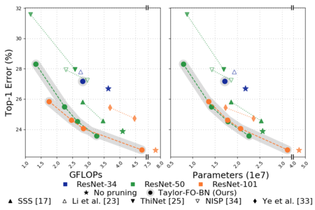

[](https://raw.githubusercontent.com/nvlabs/SPADE/master/LICENSE.md)


# Importance Estimation for Neural Network Pruning

This repo contains required scripts to reproduce results from paper:

Importance Estimation for Neural Network Pruning<br>
Pavlo Molchanov, Arun Mallya, Stephen Tyree, Iuri Frosio, Jan Kautz .<br>
In CVPR 2019.



### [License](https://raw.githubusercontent.com/nvlabs/Taylor_pruning/master/LICENSE.md)

Copyright (C) 2019 NVIDIA Corporation.

All rights reserved.
Licensed under the [CC BY-NC-SA 4.0](https://creativecommons.org/licenses/by-nc-sa/4.0/legalcode) (**Attribution-NonCommercial-ShareAlike 4.0 International**)

The code is released for academic research use only. For commercial use, please contact [researchinquiries@nvidia.com](researchinquiries@nvidia.com).

## Installation

Clone this repo.
```bash
git clone https://github.com/NVlabs/Taylor_pruning.git
cd Taylor_pruning/
```

This code requires PyTorch 1.0 and python 3+. Please install dependencies by
```bash
pip install -r requirements.txt
```

For the best reproducibility of results you will need NVIDIA DGX1 server with 8 V100. During pruning and finetuning we at most use 4 GPUs. 


The code was tested with python3.6 the following software versions:

| Software        | version | 
| ------------- |-------------| 
| cuDNN         | v7500 |
| Pytorch      | 1.0.1.post2  |
| CUDA | v10.0    |


## Preparation

### Dataset preparation

Pruning examples use ImageNet 1k dataset which needs to be downloaded beforehand. 
Use standard instructions to setup ImageNet 1k for Pytorch, e.g. from [here](https://github.com/NVIDIA/DeepLearningExamples/tree/master/PyTorch/Classification/RN50v1.5#geting-the-data).

### Models preparation

We use pretrained models provided with Pytorch, they need to be downloaded:

```
wget https://download.pytorch.org/models/resnet50-19c8e357.pth 
wget https://download.pytorch.org/models/resnet101-5d3b4d8f.pth
mkdir ./models/pretrained/
mv {resnet50-19c8e357.pth,resnet101-5d3b4d8f.pth} ./models/pretrained/
```

## Pruning examples

Results in Table 3 can be reproduced the following script running on 4 V100 GPUs:

```
python main.py --name=runs/resnet50/resnet50_prune72 --dataset=Imagenet \
--lr=0.001 --lr-decay-every=10 --momentum=0.9 --epochs=25 --batch-size=256 \ 
--pruning=True --seed=0 --model=resnet50 --load_model=./models/pretrained/resnet50-19c8e357.pth \
--mgpu=True --group_wd_coeff=1e-8 --wd=0.0 --tensorboard=True --pruning-method=22 \
--data=/imagenet/ --no_grad_clip=True --pruning_config=./configs/imagenet_resnet50_prune72.json
```

Note: we run finetuning for 25 epochs and do not use weight decay. Better model can be obtained by training longer, increasing learning and using weight decay.

Example of config file `./configs/imagenet_resnet50_prune72.json`:
```json
{
  "method": 22,
  "frequency" : 30,
  "prune_per_iteration" : 100,
  "maximum_pruning_iterations" : 32,
  "starting_neuron" : 0,
  "fixed_layer" : -1,
  "l2_normalization_per_layer": false,
  "rank_neurons_equally": false,
  "prune_neurons_max": 3200,
  "use_momentum": true,
  "pruning_silent": false,

  "pruning_threshold" : 100.0,
  "start_pruning_after_n_iterations" : 0,
  "push_group_down" : false,
  "do_iterative_pruning" : true,
  "fixed_criteria" : false,
  "seed" : 0,
  "pruning_momentum" : 0.9
}

```

We provide config files for pruning to 56%, 72%, 81%, 91% of original ResNet-50 and to 40%, 50%, 55%, 75% of ResNet-101 models. Percentage means the ratio of gates to be active after pruning.

## Parameter description

Pruning methods (different criteria) are encoded with integer as:

| method id       | name | description | comment |
| ------------- |-------------| -------------| -----|
| 22         | Taylor_gate | *Gate after BN* in Table 2, *Taylor FO* in Table 1, *Taylor-FO-BN* in Table 3 | **Best method**|
| 0          | Taylor_weight| *Conv weight/conv/linear weight with Taylor FO* In Table 2 and Table 1 | |
| 1          | Random        | Random||
| 2          | Weight norm   | Weight magnitude/ weight||
| 3          | Weight_abs    | Not used||
| 6          | Taylor_output | *Taylor-output* as in [27]||
| 10         | OBD           | Optimal Brain Damage||
| 11         | Taylor_gate_SO| Taylor SO||
| 23         | Taylor_gate_FG| uses gradient per example to compute Taylor FO, Taylor FO- FG in Table 1, Gate after BN - FG in Table 2||
| 30         | BN_weight     | *BN scale* in Table 2||
| 31         | BN_Taylor     | *BN scale Taylor FO* in Table 2||
   


### Citation

If you use this code for your research, please cite our papers.
```
@inproceedings{molchanov2019taylor,
  title={Importance Estimation for Neural Network Pruning},
  author={Molchanov, Pavlo and Mallya, Arun and Tyree, Stephen and Frosio, Iuri and Kautz, Jan},
  booktitle={Proceedings of the IEEE Conference on Computer Vision and Pattern Recognition},
  year={2019}
}
```

## To come

- Config files for DenseNet and VGG16 pruning on ImageNet
- Examples of CIFAR experiments
- Getting shrinked model after pruning (for ResNet-101 only)
- Oracle estimates of true importance, code to compute correlation with Oracle 

## Acknowledgments
This code heavily reuses Pytorch example for ImageNet training provided [here](https://github.com/pytorch/examples/tree/master/imagenet).